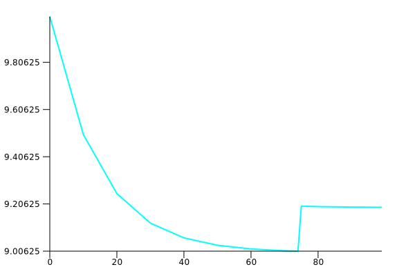

# 👌Tiny Bonds

Tiny Bonds enable anyone to raise liquidity or capital in exchange for their tokens. Tiny Bonds is a virtual constant product AMM with dutch auction functionality.



## Overview

1. Protocol XYZ wants to sell some of their XYZ tokens for DAI, so they call `create()` within the `TinyBondsFactory` to create their own `TinyBonds` market.
2. Protocol XYZ decides to sell `100 XYZ` tokens and will accept a price anywhere between `10` and `15 DAI` with a maturity of `5 days`.
3. Price will start at `15 DAI` and decrease exponentially to a floor price of `10 DAI` assuming no purchases are made. 
4. Alice notices the bond price is currently `12.5 DAI` while the markets spot is still around `15 DAI` so she decides to bond `50 XYZ` tokens for `625 DAI`.
5. Over the next 5 days, Alice can linearly redeem the XYZ token that she bonded. 

## Architecture

-   [`TinyBonds.sol`](src/TinyBonds.sol): `TinyBonds` enable anyone to raise liquidity or capital in exchange for their tokens.
-   [`TinyBondsFactory.sol`](src/TinyBondsFactory.sol): Minimal proxy factory that creates `TinyBonds` clones.

## Installation

To install with [Foundry](https://github.com/gakonst/foundry):

```
forge install 0xClandestine/tiny-bonds
```

## Local development

This project uses [Foundry](https://github.com/gakonst/foundry) as the development framework.

### Dependencies

```
forge install
```

### Compilation

```
forge build
```

### Testing

```
forge test
```